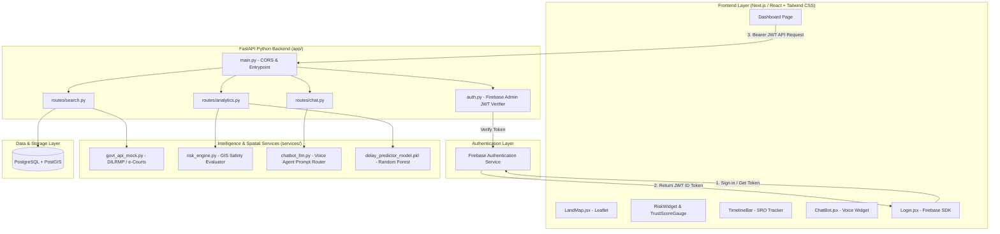

# 🏗️ System Architecture & Full Stack Topology

> **MOC Link**: [[00-Bhoomi-Mitra-MOC|Back to Master Index]]

## 1. High-Level Architecture Diagram



---

## 2. Directory Layout
```text
bhoomi-mitra-portal/
├── backend/                       # Python FastAPI Backend Services
│   ├── app/
│   │   ├── main.py                # Core App Entrypoint & Router
│   │   ├── config.py              # Environment variables & DB settings
│   │   ├── auth.py                # Firebase JWT middleware
│   │   ├── routes/                # Search, Analytics, Chat routes
│   │   ├── services/              # DILRMP mock, risk engine, LLM wrapper
│   │   └── database.py            # PostgreSQL + PostGIS connection
│   ├── requirements.txt
│   └── Dockerfile
├── frontend/                      # React / Next.js Web Frontend
│   ├── public/                    # Assets, audio cues, land icons
│   ├── src/
│   │   ├── components/            # LandMap, RiskWidget, TimelineBar, ChatBot
│   │   ├── pages/                 # Login, Dashboard
│   │   ├── App.css
│   │   └── main.jsx
│   ├── package.json
│   └── tailwind.config.js
└── ml_engine/                     # ML Pipelines
    ├── delay_predictor_model.pkl  # Trained delay model
    └── train_delay_model.py       # Scikit-Learn training script
```

---

## 3. Technology Stack Rationale
- **Frontend (React / Next.js + Tailwind CSS)**: Enables rapid prototyping of responsive, dark-mode, high-contrast interfaces with hardware-accelerated animations.
- **GIS Mapping (Leaflet.js / OpenStreetMap)**: Lightweight, zero-cost, open-source tile rendering supporting custom geo-json polygons, dynamic color fills, and coordinate bounding.
- **Backend (FastAPI Python 3.10+)**: Async native, auto-generates OpenAPI docs, seamlessly interfaces with Scikit-Learn `.pkl` models and GIS libraries (`shapely`, `geopandas`).
- **Database (PostgreSQL 15+ with PostGIS 3.3+)**: Industry standard for storing multi-polygon cadastral maps, calculating spatial intersections, and geospatial indexing (`GIST`).
- **Auth (Firebase Authentication)**: Managed security, encrypted session management, phone OTP / email logins, zero credential leak risk.

---

## 4. Related Notes
- [[Design-Tokens-and-Theme|UI/UX Design Tokens & Colors]]
- [[API-Contracts|API Endpoints & JSON Schemas]]
- [[Delay-Prediction-Engine|ML Delay Predictor Logic]]
