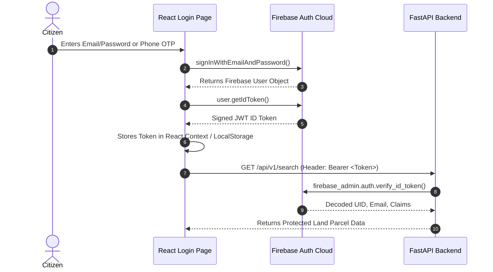

# 🔒 Firebase Authentication & Security Architecture

> **MOC Link**: [[00-Bhoomi-Mitra-MOC|Back to Master Index]]

## 1. Security Architecture
Bhoomi Mitra decouples user identity management and credential storage to **Firebase Authentication**:
- Eliminates password storage liability from the FastAPI server.
- Supports Email/Password, Google OAuth, and Phone OTP (critical for rural mobile users).
- FastAPI backend validates Firebase JWTs via the `firebase-admin` Python SDK.

---

## 2. Frontend Authentication Flow (`frontend/src/pages/Login.jsx`)


---

## 3. Backend Dependency Middleware (`backend/app/auth.py`)

```python
import os
import firebase_admin
from firebase_admin import credentials, auth as firebase_auth
from fastapi import Header, HTTPException, status

# Path to service account private key JSON or environment config
CERT_PATH = os.getenv("FIREBASE_CREDENTIALS_PATH", "credentials/firebase-adminsdk.json")

if not firebase_admin._apps:
    if os.path.exists(CERT_PATH):
        cred = credentials.Certificate(CERT_PATH)
        firebase_admin.initialize_app(cred)
    else:
        # Fallback to mock initialization in test/demo mode
        firebase_admin.initialize_app()

def get_current_user(authorization: str = Header(None)):
    """
    Validates incoming Bearer JWT against Firebase Authentication.
    Extracts citizen UID and roles.
    """
    if not authorization:
        raise HTTPException(
            status_code=status.HTTP_401_UNAUTHORIZED, 
            detail="Missing Authorization Header"
        )
    
    parts = authorization.split(" ")
    if len(parts) != 2 or parts[0].lower() != "bearer":
        raise HTTPException(
            status_code=status.HTTP_401_UNAUTHORIZED,
            detail="Invalid Authorization Header Format. Use Bearer <token>"
        )
        
    token = parts[1]
    
    # In local offline demo environments, allow demo tokens
    if os.getenv("DEMO_BYPASS_AUTH", "false").lower() == "true" and token == "demo-citizen-token":
        return {"uid": "demo-citizen-123", "email": "citizen@bhoomi-demo.in", "role": "citizen"}

    try:
        decoded_token = firebase_auth.verify_id_token(token)
        return decoded_token
    except Exception as exc:
        raise HTTPException(
            status_code=status.HTTP_401_UNAUTHORIZED, 
            detail=f"Token validation failed: {str(exc)}"
        )
```

---

## 4. Role-Based Access Control (RBAC)
- `citizen`: Can search, view risk scores, chat with Bhoomi Mitra, and download RTI templates.
- `registrar_officer`: Can update milestone status in the SRO delay pipeline and upload GIS boundary revisions.

---

## 5. Related Notes
- [[API-Contracts|Protected API Routes]]
- [[System-Architecture|System Topology]]
- [[Phase-1-Setup-and-Auth|Implementation Roadmap: Auth Setup]]
